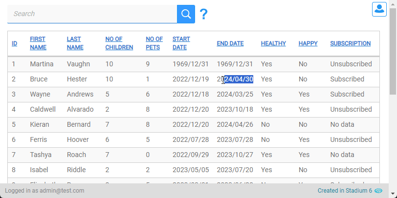

# Escape Forwardslashes in Search Boxes <!-- omit in toc -->

A script that automatically replaces all forwardslashes (/) as they are typed or pasted into any search box on a page.



# Version
Initial 1.0

# Setup

## Global Script
1. Create a Global Script called "EscapeSearchBoxSlashes"
2. Drag a *JavaScript* action into the script
3. Add the Javascript below into the JavaScript code property
```javascript
/* Stadium Script v1.0 Name https://github.com/stadium-software/utils-escape-search-forwardslashes */
let boxes = document.querySelectorAll(".data-grid-search-box");
for (let i = 0; i < boxes.length; i++) {
    boxes[i].addEventListener("input", function (e) {
        e.target.value = e.target.value.replaceAll(/[/]/g, "\\/").replaceAll(/\\{2,}/g, "\\");
    });
}
```

## Page
1. Normally add DataGrids

## Page.Load
1. Drag the "EscapeSearchBoxSlashes" script to the page Load event handler

## Working with Stadium Repos
Stadium Repos are not static. They change as additional features are added and bugs are fixed. Using the right method to work with Stadium Repos allows for upgrading them in a controlled manner. How to use and update application repos is described here 

[Working with Stadium Repos](https://github.com/stadium-software/samples-upgrading)